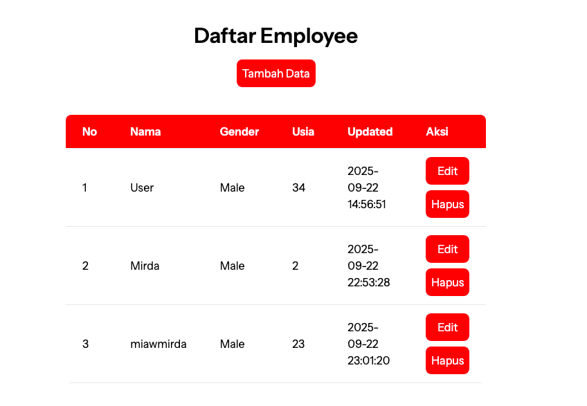
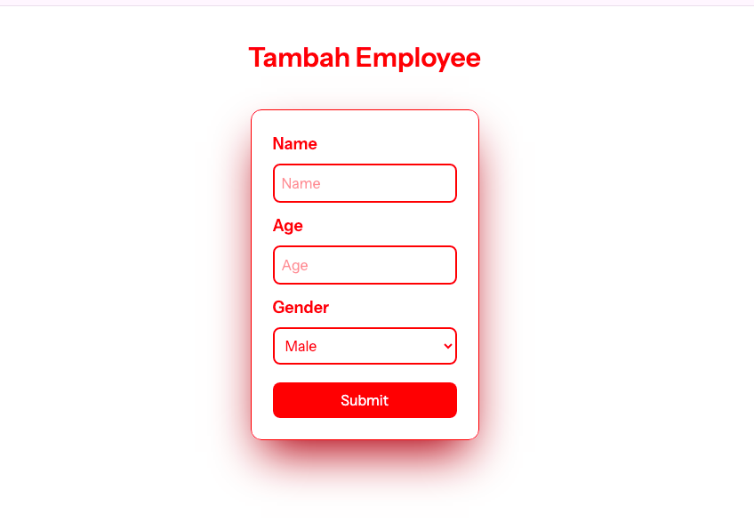
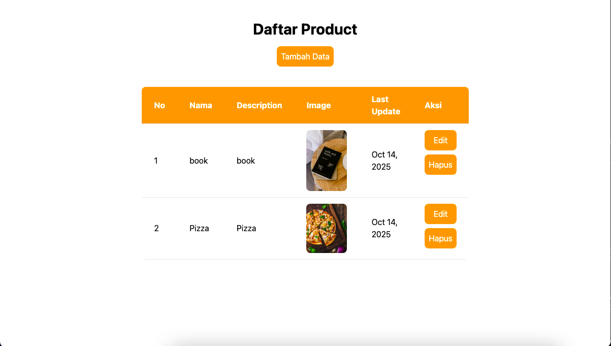
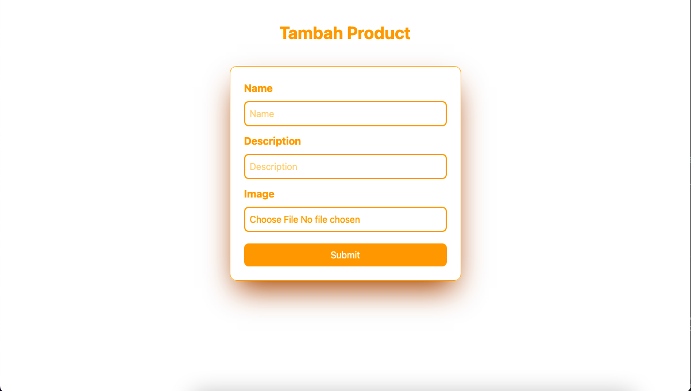

# Simple CRUD
This repository contains simple projects that demonstrate the basic CRUD operations. 

Each project is designed as a foundational example for learning how to manage data in web applications.

## Requirements
Make sure that your local machine has PHP ^8.2, Composer, and the Laravel installer installed. In addition, you should install either Node and NPM

## Screenshots

  

  Preview Employee

### Main Page

### Create New & Edit Employee Page

  
Preview Product

### Main Page

### Create New & Edit Product Page

